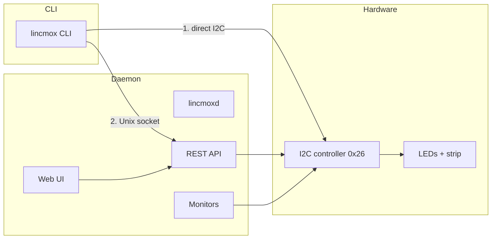

# Technical overview

This section describes the internal architecture of Lincmox and its key design choices.

## Binaries

Lincmox is a Go project distributed as two binaries:

| Binary | Package | Description |
|---|---|---|
| `lincmox` | `lincmox` | CLI — direct I2C access or proxy to the daemon |
| `lincmoxd` | `lincmoxd` | Daemon — REST API + Web UI + background monitors |

## Source layout

```
lincmox/
  internal/lincstation/   shared driver (I2C + LED control logic)
  cmd/lincmox/            CLI binary
  cmd/lincmoxd/           daemon binary (REST API + Web UI + monitors)
  web/dist/               embedded Web UI assets
```

The `internal/` package boundary ensures the driver cannot be imported by external Go
modules.

## Component interactions



## Two communication paths

The CLI uses two mutually exclusive paths, determined automatically:

1. **Direct I2C access** — when `/run/lincmoxd.sock` is absent
   (the daemon is stopped or not installed).
2. **Daemon proxy** — when the Unix socket exists, the CLI becomes an HTTP client and
   every command is proxied through the daemon. This prevents two processes from
   conflicting on the I2C bus.

| Scenario | Behavior |
|---|---|
| `lincmox` only | Direct I2C access |
| `lincmoxd` only | REST API + Web UI, no CLI |
| Both installed, daemon **running** | CLI routes transparently through Unix socket — no I2C conflict |
| Both installed, daemon **stopped** | CLI falls back to direct I2C access |

## Driver abstraction

The hardware driver lives in `internal/lincstation`. It exposes a small `i2cBus`
interface with two implementations:

- **`smbusDevice`** — real hardware access via `I2C_SLAVE`, `I2C_SMBUS` and `I2C_RDWR` ioctls.
- **`mockBus`** — an in-memory mock that persists registers to
  `/tmp/lincstation_mock_registers.json`, used by simulation mode and tests.

Bus auto-detection probes `/dev/i2c-0` through `/dev/i2c-9` for a device at address
`0x26`, using a real `I2C_RDWR` transaction first and falling back to an SMBus
send-byte (quick write) probe. The bus can also be forced with `--bus <n>`.

## Priority between monitors and manual commands

The daemon wraps the device in a `LEDController` that arbitrates access:

- **Monitors** (automatic) only write when no manual override is active.
- **Manual commands** (CLI/API) set a 30-second override TTL per LED.

See [Automatic monitors](../functional/monitors.md) for details.

## Versioning

Lincmox follows **Semantic Versioning** with Conventional Commits:

```bash
git tag v2.0.0      # stable release
git tag v2.0.0-rc1  # release candidate (testing channel)
```